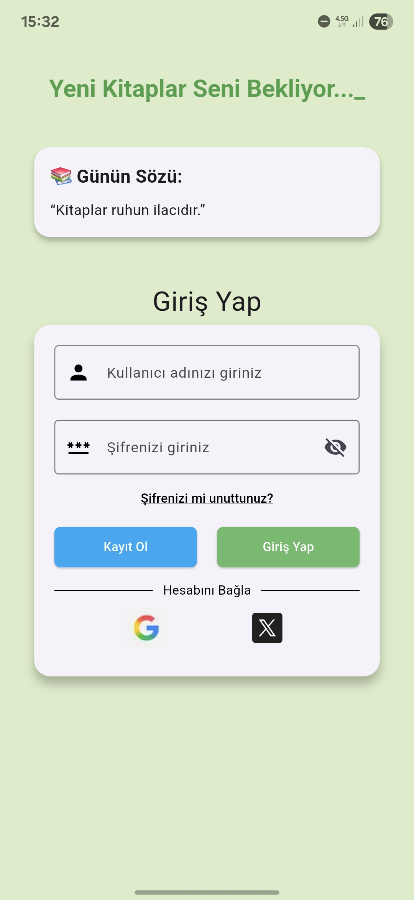
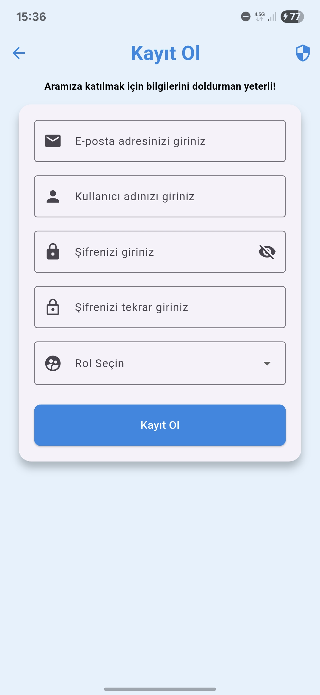
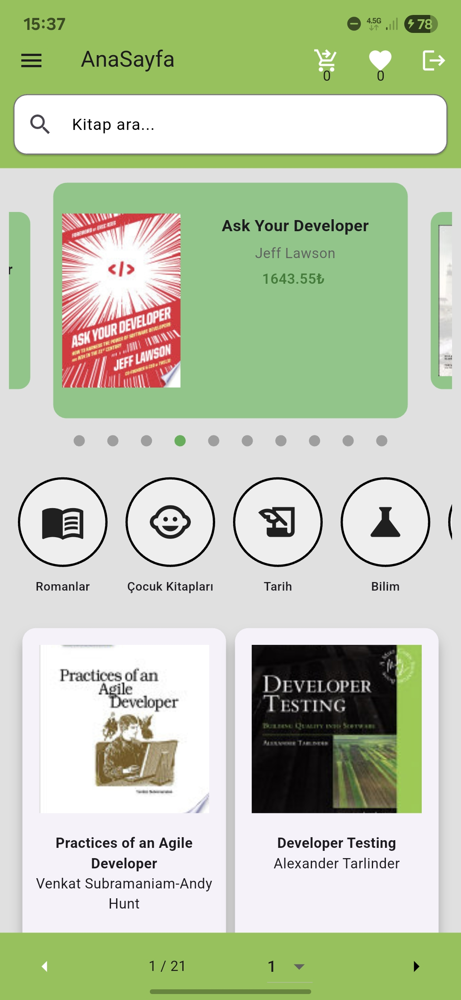
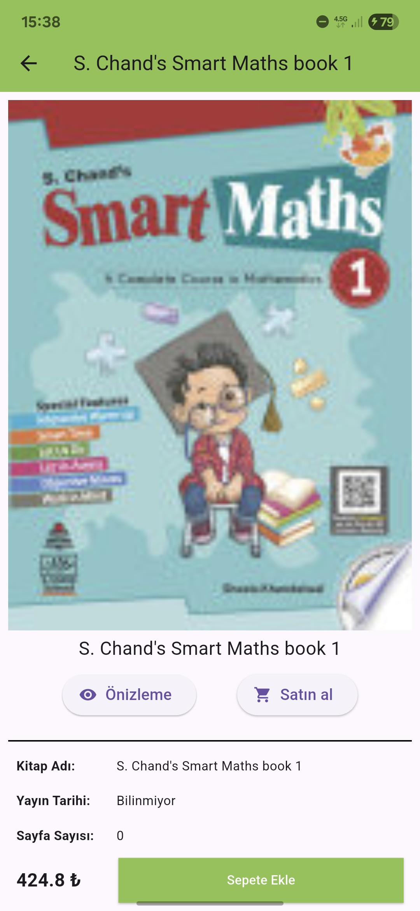
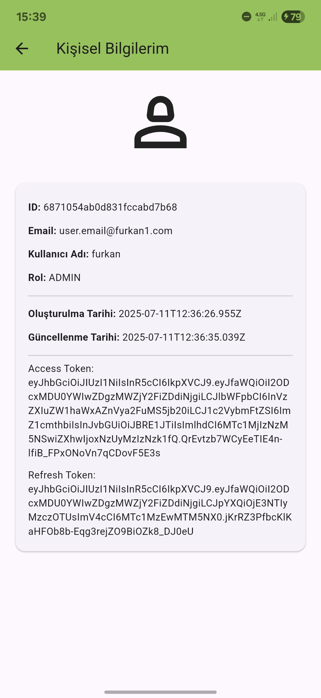
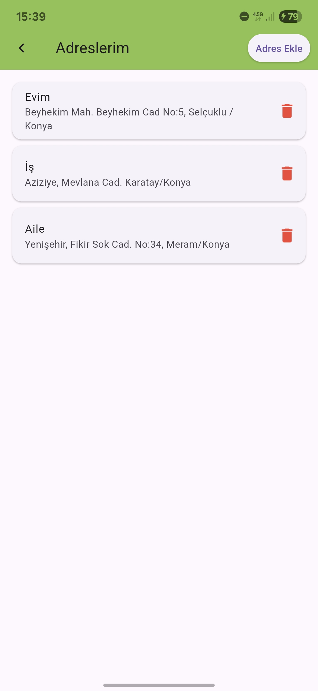
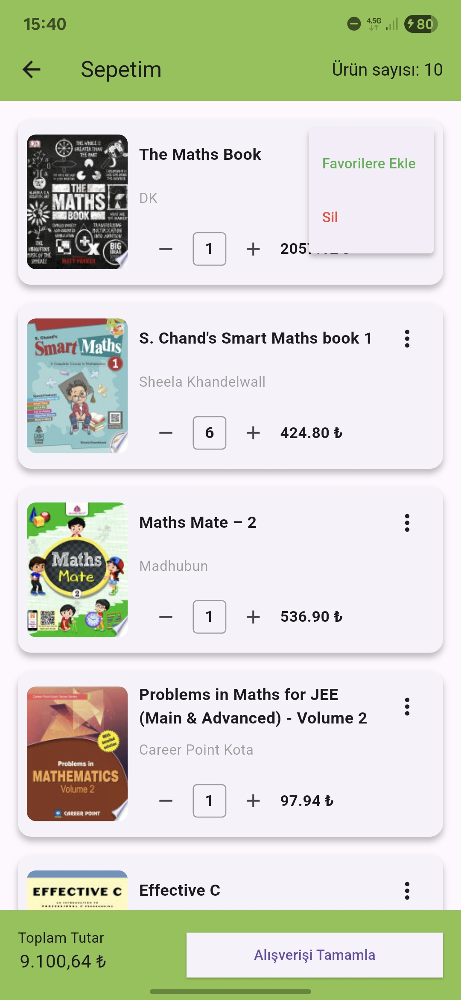
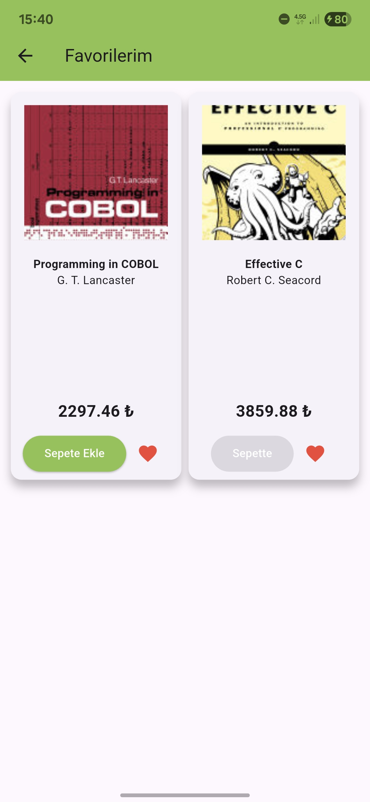
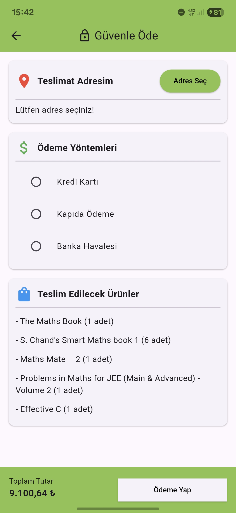
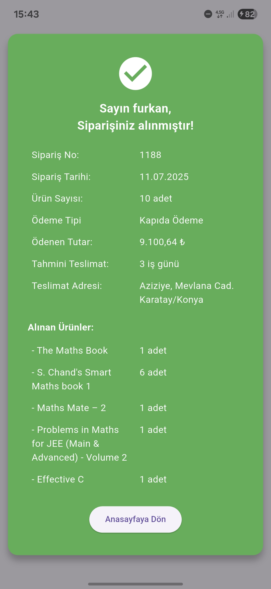

<p align="center">
  
</p>

<h1 align="center">Book App</h1>

### 📖 Hakkında
  Bu proje, **Butkon Asansör**'de yaptığım staj süresince öğrenme amacıyla geliştirilmiştir. 4 hafta boyunca mobil uygulama geliştirme ve Flutter teknolojileri üzerine yoğunlaştım. Eksiklikleri muhakkak vardır ancak bu süreç benim için çok değerli bir öğrenme deneyimiydi. 

  Desteklerinden dolayı <a href="https://github.com/BayramYARIM" target="_blank" rel="noopener noreferrer">**Bayram YARIM**</a>’a teşekkür ederim.

  👇🏻 Aşağıda Book App’in kullanıcı arayüzüne ait detaylı ekran görüntüleri mevcuttur.

---

### 🛠️ Kullanılan Teknolojiler
- Dart
- Flutter
- RESTful API
- State Management (Provider)

---

### 📸 Ekran Görüntüleri

---

#### 🔑 Giriş Yap & 📝 Kayıt Ol
<p >
  
  
</p>

#### 📕 Ana Sayfa & 📖 Kitap Detay Sayfası
<p>
  
  
</p>

#### 👤 Kişisel Bilgiler & 📍 Adreslerim
<p >
  
  
</p>

#### 🛒 Sepetim & ❤️ Favorilerim
<p >
  
  
</p>

#### 💳 Ödeme Sayfası & 📦 Sipariş Özeti
<p > 
  
  
</p>

---

### 🚀 Kurulum
```bash
git clone https://github.com/FurkanOguzgoksu/flutter-api-book-example
cd flutter-api-book-example
flutter pub get
flutter run
