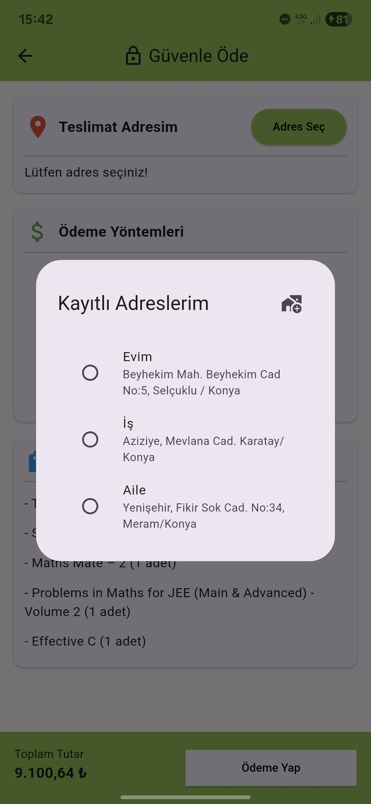

<p align="center">
  
</p>

<h1 align="center">Book App</h1>

---

### 📖 Hakkında
Bu proje, **Butkon Asansör**'de yaptığım staj süresince öğrenme amacıyla geliştirilmiştir. 4 hafta boyunca mobil uygulama geliştirme ve Flutter teknolojileri üzerine yoğunlaştım. Eksiklikleri muhakkak vardır ancak bu süreç benim için çok değerli bir öğrenme deneyimiydi.

Desteklerinden dolayı <a href="https://github.com/BayramYARIM" target="_blank" rel="noopener noreferrer"> **Bayram YARIM** </a>’a teşekkür ederim.

---

### 🛠️ Kullanılan Teknolojiler
- Dart
- Flutter
- RESTful API
- State Management (Provider)

---

### 📸 Ekran Görüntüleri

#### 📕 Ana Sayfa


#### 📖 Kitap Detay Sayfası


#### 👤 Kişisel Bilgiler


#### 📍 Adreslerim


#### ❤️ Favorilerim


#### 🛒 Sepetim


#### 💳 Ödeme Sayfası


#### 📦 Sipariş Özeti


#### 🔑 Giriş Yap


#### 📝 Kayıt Ol


---

### 🚀 Kurulum
```bash
git clone https://github.com/FurkanOguzgoksu/flutter-api-book-example
cd flutter-api-book-example
flutter pub get
flutter run
